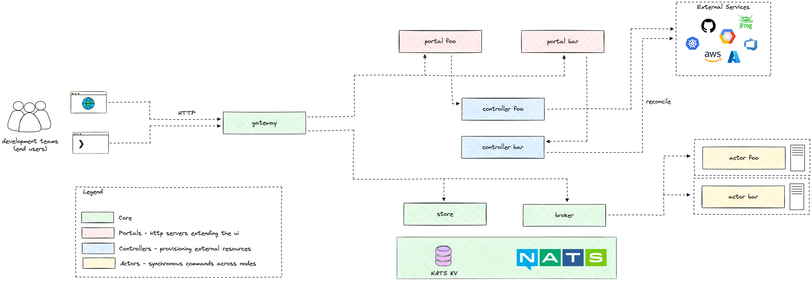

# Horizon 🌅 - Build your Internal Developer Platform

> Horizon provides essential building blocks and patterns for creating a minimal internal platform that enables developer self-service and autonomy.

## Why Horizon?

Building internal platforms that enable developer self-service and improve the developer experience is hard.

At Verifa we have seen two common approaches from platform teams (also known as DevOps teams or DevEx teams):

1. Exposing tools like Terraform and Helm directly to the end users.

    Those abstractions (i.e. Terraform modules and Helm charts) are [leaky](https://en.wikipedia.org/wiki/Leaky_abstraction) and expose the underlying technology (i.e. Terraform and Kubernetes).
    This negatively impacts developers' flow and cognitive load.

2. Deploy an Internal Developer Platform / Portal (IdP), like [Backstage](https://backstage.io/).

    This provides a very elegant UI for developers, but does not take care of provisioning anything.
    For provisinioning you still need something like Kubernetes + some infrastructure provisioner (like CrossPlane or a Terraform controller).
    Also this is a very complex stack of tools to maintain and requires significant development to be useful.

Horizon is an attempt to get the best of both worlds without a complex stack to maintain.
Horizon's only hard dependency is [NATS](https://nats.io/), and it makes heavy use of it!

Horizon is not "off the shelf". In fact the idea is that you build and own the Horizon extensions you need.
Do not expect a big ecosystem or lots of plugins you can install or lots of pretty graphs and UI elements: expect a thin layer on top of NATS to help you build only what you need.

> [!WARNING]
> Horizon is still a Proof of Concept.
>
> If you have come here please be gentle and do not expect the APIs to be stable.
> If you think Horizon could be useful for your internal platform then please give it a try, and feel free to start a discussion with your use case and we will try to help.

## How it works

As the platform team building this for your end users (i.e. the software development teams) you are creating **an interface** on top of your **underlying platform**. This interface is incredibly important because it can **decouple your end users** away from the **platform technologies**.

> [!WARNING]
> If you want to use Horizon you will need to write and maintain code.
>
> At this time, Go is the only supported language. If the concept of building a platform with Go worries you, I suggest you turn around now :)

Below is a high-level overview of the different Horizon components. For a more detailed explanation of the components, see the [Architecture](#architecture) section.

> [!NOTE]
> All communication is handled via NATS. As such, the dotted lines between components do not actually exist but are subject-based pub/subs via NATS.

Your end users will typically interact with Horizon via HTTP servers (portals) or command line tools that the platform team build. More on [portals](./docs/architecture.md#platform---portals).

For provisioning "resources" (e.g. cloud infrastructure, Git repositories, artifact respositories) the platform team will define objects and a controller to handle reconciliation (taking an object specifiation and moving the object towards the desired state). More on [controllers](./docs/architecture.md#platform---controllers).

For running operations across different nodes, actors can be called via the broker and actors are selected based on their labels. More on [actors](./docs/architecture.md#platform---actors).

## Architecture

Check the [architecture](./docs/architecture.md) document for some more information on the different components.

## Getting started

Check the [getting started](./docs/gettingstarted.md) section.

## Examples

Check the [examples](./examples/) folder for some examples.

A recommended starting point would be the incredibly useful (joke) [greetings](./examples/greetings/README.md) example.
It has a portal, controller and actor and does not depend on any external services, so there is no added complexity due to third party dependencies.

## Frequently Asked Questions

Check the [FAQ](./docs/faq.md) page.

## Debugging with NATS

Check the [debugging with nats](./docs/debugging_nats.md) page.

## Resources / Learning

Check the [resources](./docs/resources.md) for some material to help you learn NATS and generally about platform engineering.

## Alternatives / Similar tools

Horizon has no opinion about what tools/libraries/SDKs you use to communicate with external services: as you code in Go with Horizon you can do whatever you want.

Hence, things like [Terraform](https://www.terraform.io/), [Pulumi](https://www.pulumi.com/), [Helm](https://helm.sh/), various CDKs (e.g. [AWS](https://aws.amazon.com/cdk/), [K8s](https://cdk8s.io/)), or any cloud SDK can all be used by your controllers or actors.

At the same time, we feel that no existing Internal Development Portals/Platforms are quite the same as Horizon.

Tools like [Backstage](https://backstage.io/) provides a "single pane of glass" but do not provide the backend for provisioning external resources.

[Kratix](https://kratix.io/) is a "platform framework" that uses [Kubernetes](https://kubernetes.io/) to provision external resources, but requires something like [Backstage](https://backstage.io/) as a UI.

Here is a nice visual of the [platform tooling landscape](https://platformengineering.org/platform-tooling) and Horizon would sit in the Developer Portal box.

## License

This code is released under the [Apache-2.0 License](./LICENSE).
